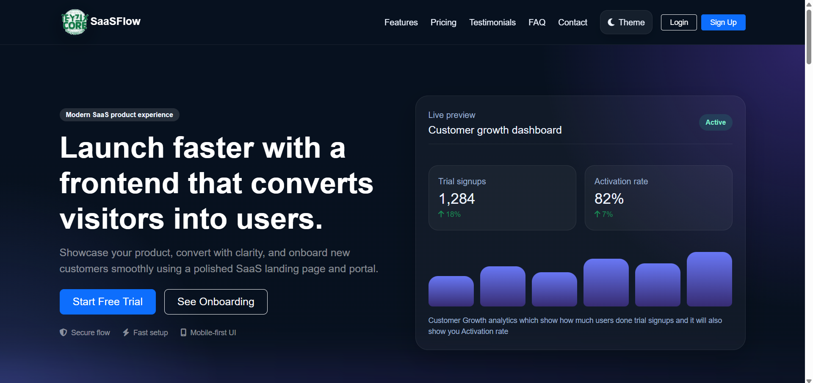

# 🚀 SaaS Product Landing Page & Customer Onboarding Portal

> A modern, responsive SaaS frontend built with **HTML, CSS, Bootstrap, and JavaScript**, featuring a complete customer onboarding experience, persistent theme management, and an interactive dashboard preview.

<p align="center">


</p>

---

## 📖 About The Project

This project was developed as part of a **Frontend Development Internship** to simulate a real-world SaaS product.

The goal was to design and develop a professional landing page that not only introduces a software product but also guides users through a complete onboarding journey before presenting a modern dashboard interface.

Unlike a simple landing page, this project focuses on delivering an engaging user experience through responsive design, clean UI components, client-side validation, persistent user preferences, and interactive features using only frontend technologies.

Everything is built without a backend, demonstrating how browser technologies and Local Storage can create a polished and realistic SaaS experience.

---

# 📸 Project Preview


## Landing Page

```

```

## Features Section

```
assets/features.png
```

## Pricing Section

```
assets/pricing.png
```

## Login Page

```
assets/login.png
```

## Signup Page

```
assets/signup.png
```

## Customer Onboarding

```
assets/onboarding.png
```

## Dashboard

```
assets/dashboard.png
```

## Light Mode

```
assets/responsive.png
```

---

# ✨ Features

### Landing Page

* Modern Hero Section
* Product Overview
* Features & Benefits
* Pricing Plans
* Customer Testimonials
* FAQ Section
* Contact Form
* Responsive Footer

### Authentication

* Login Page
* Signup Page
* Password Strength Indicator
* Client-side Form Validation
* Error Handling

### Customer Onboarding

* Multi-Step Registration
* Progress Indicator
* Previous & Next Navigation
* Form Validation
* User Information Summary
* Completion Screen

### Dashboard Preview

* Analytics Cards
* Recent Activity Feed
* User Profile
* Responsive Sidebar
* Mobile Friendly Layout

### Bonus Features

* 🌙 Dark / Light Mode
* 🎨 Theme Customizer
* 💰 Interactive Pricing Calculator
* 💾 Local Storage Persistence

---

# 🛠️ Built With

* HTML5
* CSS3
* Bootstrap 5
* JavaScript (ES6)
* Font Awesome
* Local Storage

---

# 📂 Project Structure

```text
project-root/
│
├── index.html
├── login.html
├── signup.html
├── onboarding.html
├── dashboard.html
│
├── css/
│   ├── style.css
│   └── dashboard.css
│
├── js/
│   ├── main.js
│   ├── onboarding.js
│   ├── dashboard.js
│   ├── pricing.js
│   └── theme.js
│
└── assets/
    ├── images/
    └── icons/
```

---

# 🎯 Key Highlights

* Fully Responsive Design
* Mobile-First Layout
* Semantic HTML
* Bootstrap Grid System
* Modern UI Components
* Reusable Styling
* Smooth User Experience
* Clean Code Structure
* Beginner-Friendly JavaScript
* Persistent Theme Settings
* Multi-Step Onboarding Flow
* Browser Storage Integration

---

# 🌙 Theme System

The application includes a persistent theme system powered by **Local Storage**.

Users can:

* Switch between Light and Dark Mode
* Save theme preferences
* Keep preferences after page refresh
* Experience smooth theme transitions

---

# 💰 Interactive Pricing Calculator

The pricing calculator allows users to:

* Choose a pricing plan
* Switch between Monthly and Yearly billing
* Automatically calculate pricing
* View discounted yearly plans

---

# 📱 Responsive Design

The project is designed using a **mobile-first approach** and works smoothly across:

* Desktop
* Laptop
* Tablet
* Mobile Devices

---

# ♿ Accessibility

The project follows modern frontend practices including:

* Semantic HTML
* Accessible Forms
* Proper Heading Structure
* Responsive Navigation
* Keyboard-Friendly Inputs

---

# 🚀 Future Improvements

Potential future enhancements include:

* Backend Integration
* User Authentication
* Database Support
* Payment Gateway Integration
* Email Verification
* Real Analytics
* Interactive Charts
* Multi-language Support
* Role-Based Dashboard

---

# 🎓 What I Learned

Building this project strengthened my understanding of:

* Responsive Web Design
* Bootstrap Layout System
* JavaScript DOM Manipulation
* Form Validation
* Local Storage
* Multi-Page Frontend Architecture
* State Management Without a Backend
* UI/UX Best Practices
* Clean Code Organization

---

# 👨‍💻 Author

**Sufiyan Shahid**

Frontend Developer

* LinkedIn: *(Add your LinkedIn profile here)*
* GitHub: *(Add your GitHub profile here)*

---

# ⭐ Acknowledgement

This project was created as part of a **Frontend Development Internship** to demonstrate practical frontend engineering skills, modern UI development, responsive design principles, and clean JavaScript architecture. It reflects a real-world SaaS product workflow while showcasing best practices in frontend development.

---

## 📜 License

This project is intended for educational and portfolio purposes.
